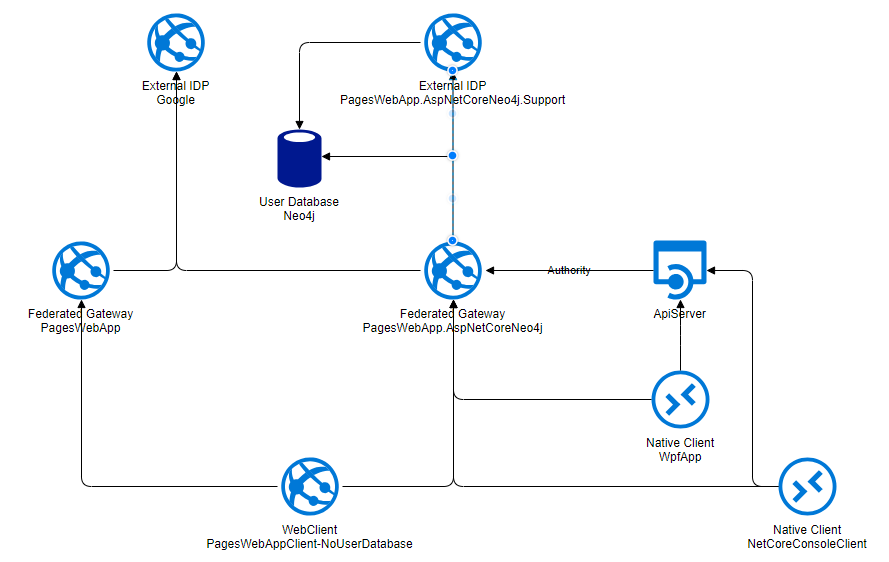

# IdentityServer4 Asp.Net 2.1 Identity Examples

All these examples are based on the following;  
  * asp.net 2.1 WebApp  
  * asp.net identity  

## The IdentityServer4 Host
[PagesWebApp](src/PagesWebApp)  
[PagesWebApp.AspNetCoreNeo4j](src/PagesWebApp.AspNetCoreNeo4j)  

## External IDP
[PagesWebApp.AspNetCoreNeo4j.Support](src/PagesWebApp.AspNetCoreNeo4j.Support)  
This IDP shares the same Neo4j user database.  The support IDP is used by a support agent to ask may factor questions which results in a login.  The Support idp is recorded in the id_token so that the final clients know the difference between a user login vs on that was done over the phone.

## Clients
[PagesWebAppClient](src/PagesWebAppClient)  
This is a full on asp.net 2.1 Identity app, which has its own user database.  This is what you would typically see pointing to Google, Twitter, and our own OIDC [PagesWebApp](src/PagesWebApp)  

[PagesWebAppClient-NoUserDatabase](src/PagesWebAppClient-NoUserDatabase)  
This is still using asp.net 2.1 Identity, however the user database is in-memory.  A little trick I do is during the [ExternalLogin Callback](src/PagesWebAppClient-NoUserDatabase/Areas/Identity/Pages/Account/ExternalLogin.cshtml.cs)  I create the user, sign them in, and then promptly delete the user.  I have found out that in the case of using an external system as my user database, that there is no need to call any UserManager stuff.  This one only points to our single OIDC [PagesWebApp](src/PagesWebApp)  

# References
[learnrazorpages](https://www.learnrazorpages.com/razor-pages)  
[IdentityServer4.AspNetIdentity](https://github.com/IdentityServer/IdentityServer4.AspNetIdentity)  
[asp.net core 2.1](https://docs.microsoft.com/en-us/aspnet/core/aspnetcore-2.1?view=aspnetcore-2.1)  

