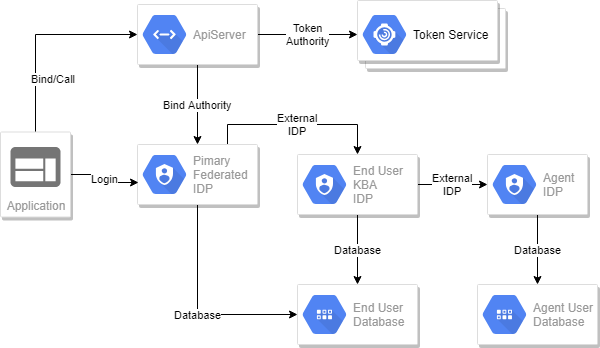
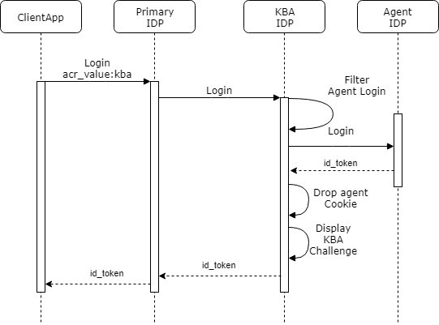

# IdentityServer4 Asp.Net 2.1 Identity Examples

applicationhost.config
``` 
<requestFiltering>
 <requestLimits maxAllowedContentLength="30000000" maxQueryString="32768"/>
</requestFiltering>
```
In our test case we are chaining up 2 idps, which starts to build up a pretty big request query string.




All these examples are based on the following;  
  * asp.net 2.1 WebApp  
  * asp.net identity  
  
## Minimal Apps
1. Neo4J desktop  
   The User Database
2. [PagesWebApp.AspNetCoreNeo4j](src/PagesWebApp.AspNetCoreNeo4j)  
   The Federated Gateway
3. [PagesWebApp.AspNetCoreNeo4j.Support](src/PagesWebApp.AspNetCoreNeo4j.Support)  
   The KBA End User IDP.  This points to the same user database as the federated gateway.  It uses the challenge factors to authenticate the user.
4. [PagesWebApp.AspNetCoreNeo4j.SupportAgent](src/PagesWebApp.AspNetCoreNeo4j.SupportAgent)  
   The External SupportAgent IDP.  This points to an isolated SupportAgent user data in neo4j. 


## Neo4j Setup
[Neo4j Desktop](https://neo4j.com/download/)  

```
"neo4JConnectionConfiguration": {
    "connectionString": "bolt://127.0.0.1:7687",
    "userName": "neo4j",
    "password": "password"
  }
```
Make sure you create a project in Neo4j using the above settings.  The following projects require Neo4J;
[PagesWebApp.AspNetCoreNeo4j](src/PagesWebApp.AspNetCoreNeo4j)  
[PagesWebApp.AspNetCoreNeo4j.Support](src/PagesWebApp.AspNetCoreNeo4j.Support)  
[PagesWebApp.AspNetCoreNeo4j.SupportAgent](src/PagesWebApp.AspNetCoreNeo4j.SupportAgent)  

## IdentityServer4 Federated Gateways 
[PagesWebApp](src/PagesWebApp)  
This Federated Gateway is using the out-of-the-box framework provided by Microsoft.  

[PagesWebApp.AspNetCoreNeo4j](src/PagesWebApp.AspNetCoreNeo4j)  
This Federated Gateway is using Neo4j as its user store.  It also points to our End User KBA IDP as an external IDP.  

## External IDP
[PagesWebApp.AspNetCoreNeo4j.Support](src/PagesWebApp.AspNetCoreNeo4j.Support)  
This IDP shares the same Neo4j user database as [PagesWebApp.AspNetCoreNeo4j](src/PagesWebApp.AspNetCoreNeo4j).  The end user KBA IDP is used by a support agent to ask many factor questions which results in a login.  The KBA idp returns an id_token that has the end user as the subject, but it contains a bunch of claims that identifies the support agent and the KBA questions that where used to get this identity.

Don't forget to add many factors to a user using the Federated Gateway [PagesWebApp.AspNetCoreNeo4j](src/PagesWebApp.AspNetCoreNeo4j);  

Here is an [example](https://jwt.io/#debugger-io?token=%7B%5Bid_token%2CeyJhbGciOiJSUzI1NiIsImtpZCI6IjAzM2ZkZjQ2YjZkODdkOThmNzIzY2U4YTE0MzBiMjBhIiwidHlwIjoiSldUIn0.eyJuYmYiOjE1NDAyMzA1MTksImV4cCI6MTU0MDIzMDgxOSwiaXNzIjoiaHR0cHM6Ly9sb2NhbGhvc3Q6NDQzMTgiLCJhdWQiOiJmZWRlcmF0ZWQtaWRwIiwibm9uY2UiOiI2MzY3NTgyNzMxOTAyOTE2MzguTVRnMU9XTTBabUV0WWprM01DMDBabVprTFdJd01qY3ROVFZpTVRWa1pqZ3dOREF6Tm1NNU5EQm1aRGt0WkdNM01pMDBaR0kyTFdGa05Ea3RaR0V6Tm1OaVlUVTFaV0ZoIiwiaWF0IjoxNTQwMjMwNTE5LCJzaWQiOiJjYTBhZTUyZjc0N2U2OWE3ZWIxMDRiZDljYzJjYTVlOCIsInN1YiI6IjE1MDUxZGFmLTE2NTQtNDJmOS1hODNkLWUyY2ZjZjE1MjY3NyIsImF1dGhfdGltZSI6MTU0MDIzMDQ3NywiaWRwIjoiSWRlbnRpdHkuQXBwbGljYXRpb24iLCJwcmVmZXJyZWRfdXNlcm5hbWUiOiJ0ZWRAdGVkLmNvbSIsIm5hbWUiOiJ0ZWRAdGVkLmNvbSIsInJvbGUiOiJhZ2VudF9wcm94eSIsImFtciI6WyJLQkFEZXJpdmVkIiwiYWdlbnQ6dXNlcm5hbWU6YWdlbnQwQHN1cHBvcnR0ZWNoLmNvbSIsImFnZW50OmNoYWxsZW5nZVF1ZXN0aW9uOkZpcnN0IENhciIsImFnZW50OmNoYWxsZW5nZVF1ZXN0aW9uOkZpcnN0IEhvdXNlIiwiYWdlbnQ6Y2hhbGxlbmdlUXVlc3Rpb246Rmlyc3QgUGV0IiwiZXh0ZXJuYWwiXX0.RQBsimIjRD0HcDNGZZiN6HH5r9CoMVV2SaXPBtmxeZt8tTdzHON9Wn-SohF2fUFVvwsAV-Dsj-HwDy3xxoBWWv7N-ZwIQ-np37Fl0k2DQCDVAQJtccwEprNAx_qnM7HI1FmgQlfPI9Mpw_ctZAljMDg5ocGy1ufh_uZMjh6FC3oRuyg8MJOGk9eT1EKZskpEwIkhBoNjd6Rf32cywjx_Xwey3gviuDjaZUN8gu86w4IzZwvfQXITt5LjSP9h8kgbsL6qFObftSVumTtxH2jOMsI2DEqIdAkgudOfAXOiMleksochTH9VOZOnWyPkMHNxdlh35YiIEamUfmbjSJbkSQ%5D%7D) of what in id_token has in it after a KBA Login.  




 
## Web Clients
[PagesWebAppClient](src/PagesWebAppClient)  
This is a full on asp.net 2.1 Identity app, which has its own user database.  This is what you would typically see pointing to Google, Twitter, and our own OIDC [PagesWebApp](src/PagesWebApp)  

[PagesWebAppClient-NoUserDatabase](src/PagesWebAppClient-NoUserDatabase)  
This is still using asp.net 2.1 Identity, however the user database is in-memory.  A little trick I do is during the [ExternalLogin Callback](src/PagesWebAppClient-NoUserDatabase/Areas/Identity/Pages/Account/ExternalLogin.cshtml.cs)  I create the user, sign them in, and then promptly delete the user.  I have found out that in the case of using an external system as my user database, that there is no need to call any UserManager stuff.  This one only points to our single OIDC [PagesWebApp](src/PagesWebApp)  

## Native Clients
[NetCoreConsoleClient](src/NetCoreConsoleClient)  
[WpfApp](src/WpfApp)  

# References
[learnrazorpages](https://www.learnrazorpages.com/razor-pages)  
[IdentityServer4.AspNetIdentity](https://github.com/IdentityServer/IdentityServer4.AspNetIdentity)  
[asp.net core 2.1](https://docs.microsoft.com/en-us/aspnet/core/aspnetcore-2.1?view=aspnetcore-2.1)  
[AspNetCore.Identity.Neo4j](https://github.com/dopare/AspNetCore.Identity.Neo4j)  


